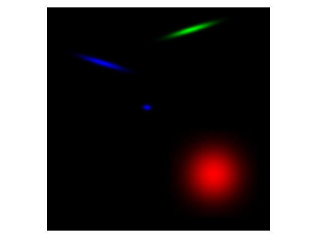

# 2D_gaussian_splatting

from https://github.com/OutofAi/2D-Gaussian-Splatting
Code Explanation see at https://zhuanlan.zhihu.com/p/686991175
test 2d gaussian splatting generator function:  
```python test_generate_2D_gaussian_splatting.py```

run demo:  
```python main.py```


## generating 2D Gaussian Splatting ##

The core function for generating 2D Gaussian Splatting. The core mechanic of this function is as follow

> Constructs a 2D Gaussian kernel using provided batch of sigma_x, sigma_y, and rho


> Normalises and reshapes the kernel to RGB channels, pads to match the image size, and translates based on given coords. Basically poutting the relevant kernel in the relevant coordinate position.


> Multiplies the RGB kernels with given colours, sums up the layers, and returns the final clamped and permuted image.  
## Structural Similarity Index (SSIM) ##
This function calculates the combined loss by taking the weighted sum of L1 (mean absolute error) loss and the SSIM-based loss, controlled by lambda_param. This approach might be used to balance the importance of pixel-level accuracy (L1) and perceptual quality (SSIM) in the training of neural networks.


 